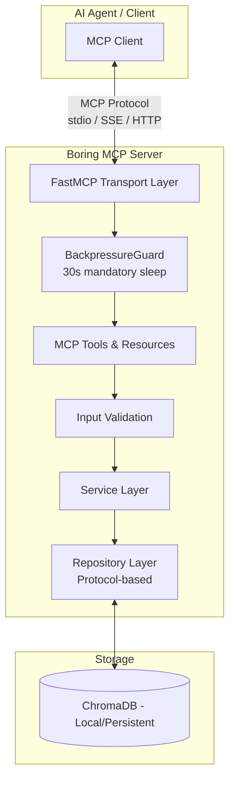
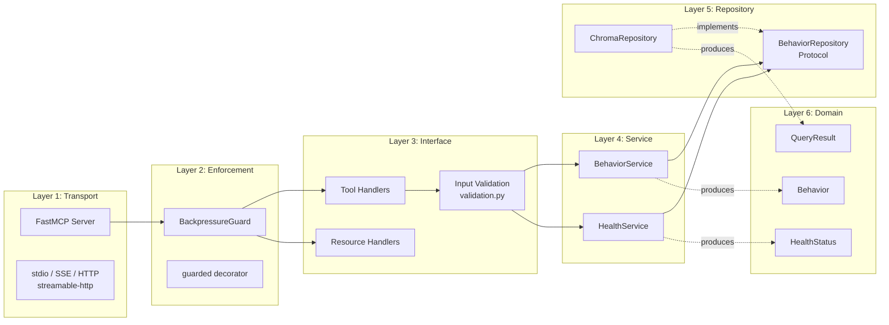
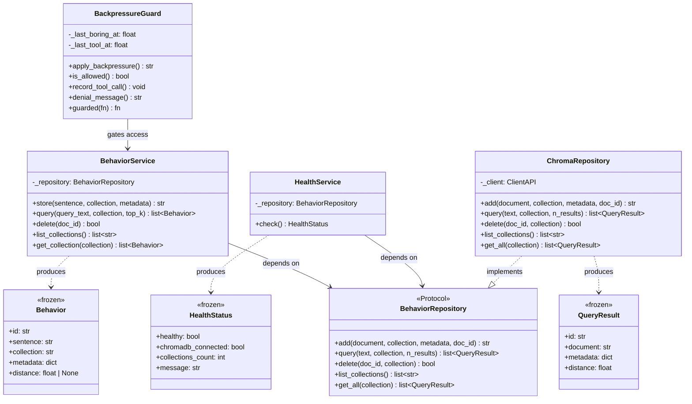
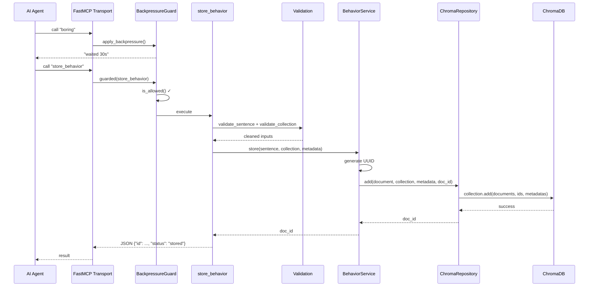
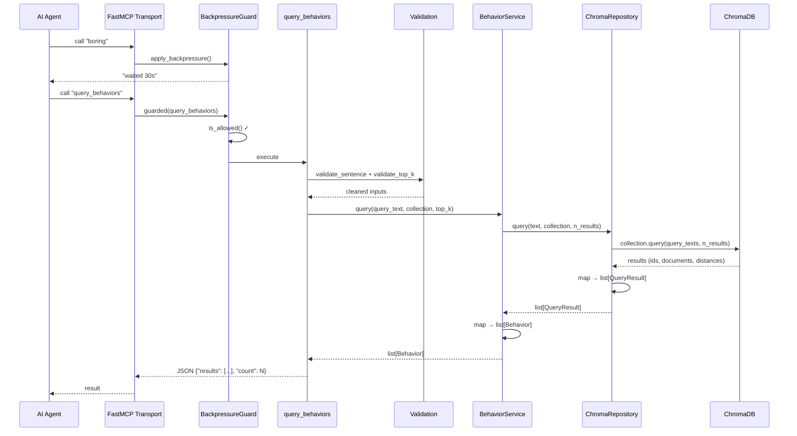
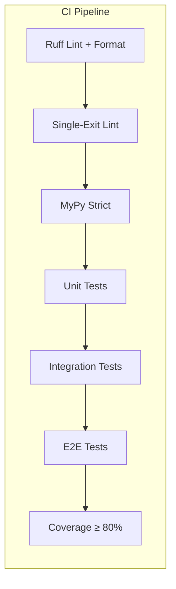

# Boring MCP — Architecture

## Overview

Boring MCP is a **Model Context Protocol** server built with **FastMCP** (Python),
backed by a local **ChromaDB** vector database. It follows **SOLID principles** and
**Clean Architecture** with strict typing (MyPy strict), 99%+ test coverage, and
server-enforced backpressure.

---

## SOLID Principles Applied

| Principle | Implementation |
|-----------|---------------|
| **Single Responsibility** | Each module has one job: `backpressure.py` enforces gates, `validation.py` validates inputs, `serializers.py` handles serialization |
| **Open/Closed** | New repositories (Pinecone, Qdrant) implement `BehaviorRepository` Protocol — no existing code changes needed |
| **Liskov Substitution** | `ChromaRepository` structurally satisfies the `BehaviorRepository` Protocol — all clients work identically |
| **Interface Segregation** | `BehaviorRepository` Protocol defines only 5 essential methods — no bloated interfaces |
| **Dependency Inversion** | Services depend on the `BehaviorRepository` Protocol, never on `ChromaRepository` directly |

---

## High-Level Architecture



---

## Layer Responsibilities



---

## Component Diagram



---

## Data Flow: Store Behavior



---

## Data Flow: Query Behaviors



---

## Project Structure

```
boring-mcp/
├── pyproject.toml              # Project config, deps, mypy, pytest, ruff
├── README.md                   # Market-facing documentation
├── ai-docs/                    # Agent-facing documentation
│   ├── agents.md               # Integration guide & backpressure rules
│   ├── architecture.md         # This file
│   ├── backpressure.md         # All 8 backpressure techniques explained
│   ├── state.md                # Current project health & metrics
│   └── skill-extend-mcp.md    # Step-by-step extension guide
│
├── .agents/skills/             # AI agent skills (Copilot CLI format)
│   └── extend-boring-mcp/     # Skill for extending the MCP server
│       └── SKILL.md
│
├── plans/
│   └── roadmap.md              # Feature roadmap (6 phases)
│
├── src/boring_mcp/
│   ├── __init__.py
│   ├── __main__.py             # python -m boring_mcp entry
│   ├── server.py               # FastMCP wiring, tool registration
│   ├── backpressure.py         # BackpressureGuard + @guarded decorator
│   ├── validation.py           # Input validation (no external deps)
│   ├── serializers.py          # Shared Behavior → dict serialization
│   ├── exceptions.py           # Domain-specific exceptions
│   ├── logging.py              # Structured logging configuration
│   ├── seed.py                 # YAML-based behavior seeding utility
│   ├── models/
│   │   ├── behavior.py         # Behavior (frozen dataclass)
│   │   └── results.py          # QueryResult (frozen dataclass)
│   ├── services/
│   │   ├── behavior_service.py # Business logic orchestration
│   │   └── health_service.py   # Health & connectivity checks
│   ├── repositories/
│   │   ├── base.py             # BehaviorRepository (Protocol)
│   │   └── chroma.py           # ChromaDB implementation
│   ├── tools/
│   │   ├── behaviors.py        # store/query/delete handlers
│   │   ├── collections.py      # list_collections handler
│   │   ├── boring.py           # Standalone backpressure coroutine
│   │   └── health.py           # health_check handler
│   └── resources/
│       └── behaviors.py        # behaviors://{collection}, behaviors://summary
│
├── tests/
│   ├── conftest.py             # Shared fixtures (EphemeralClient)
│   ├── unit/                   # Pure logic tests (no I/O)
│   ├── integration/            # Tools + Services + ChromaDB (in-memory)
│   └── e2e/                    # Full server pipeline via call_tool
│
├── scripts/
│   └── lint_single_return.py   # Custom AST linter (single-exit-point)
│
├── data/
│   └── example_behaviors.yaml  # Sample seed file
│
└── .github/workflows/ci.yml    # CI: lint → test → typecheck
```

---

## Technology Stack

| Component | Technology | Rationale |
|-----------|-----------|-----------|
| MCP Framework | FastMCP ≥ 2.0 | Official Python MCP SDK, decorator-based |
| Vector DB | ChromaDB (local) | Zero-config, embeds internally, persistent |
| Type Checking | MyPy (strict) | No `Any`, no implicit optionals |
| Validation | Custom `validation.py` | Zero dependencies, single-exit-point compliant |
| Serialization | `serializers.py` | DRY: one serializer, shared across layers |
| Logging | Python `logging` | Structured, configurable via env var |
| Testing | pytest + pytest-cov | 99%+ coverage, 3-tier test structure |
| Linting | Ruff + custom AST | Fast, comprehensive, single-exit-point |
| Package Manager | uv | Fast, lockfile-based, reproducible |
| CI/CD | GitHub Actions | lint → test → typecheck pipeline |
| Python | 3.11+ | Modern typing (ParamSpec, `X | Y` syntax) |

---

## Test Strategy



| Level | What's Tested | Dependencies | Speed |
|-------|--------------|-------------|-------|
| Unit | Models, services, guard, validation | Mocked repos | < 1s |
| Integration | Tools + services + real ChromaDB | EphemeralClient | < 2s |
| E2E | Full tool pipeline via `server.call_tool` | Full server instance | < 6s |

---

## Configuration

| Variable | Default | Description |
|----------|---------|-------------|
| `BORING_MCP_CHROMA_PATH` | `./data/chroma` | ChromaDB storage (empty = in-memory) |
| `BORING_MCP_TRANSPORT` | `stdio` | Transport: stdio, sse, http, streamable-http |
| `BORING_MCP_LOG_LEVEL` | `INFO` | Logging: DEBUG, INFO, WARNING, ERROR |

---

## Design Decisions

### Why Backpressure is Server-Enforced

Documentation-only backpressure is unenforceable — agents will skip it. The
`BackpressureGuard` makes compliance a server-side invariant: no `boring` call → no
tool execution. The `@guard.guarded` decorator keeps this DRY across all tools.

### Why Protocol (Not ABC)

Python's `Protocol` enables structural subtyping — any class with the right methods
satisfies the interface without explicit inheritance. This keeps the repository layer
decoupled and makes testing with mocks trivial.

### Why Frozen Dataclasses

Immutable domain objects (`Behavior`, `QueryResult`, `HealthStatus`) eliminate
mutation bugs, make data flow traceable, and are thread-safe by construction.

### Why No Pydantic at Runtime

After evaluating trade-offs, we removed Pydantic as a runtime dependency. Input
validation is handled by a lightweight `validation.py` module that follows the same
single-exit-point rule as the rest of the codebase. This reduces the dependency
footprint and keeps validation logic explicit and testable.

### Why Single-Exit-Point

Every function has exactly one `return` at the end. This makes control flow
predictable, eliminates hidden exit paths, and makes code review trivial. The custom
AST linter in `scripts/lint_single_return.py` enforces this at commit time and in CI.
