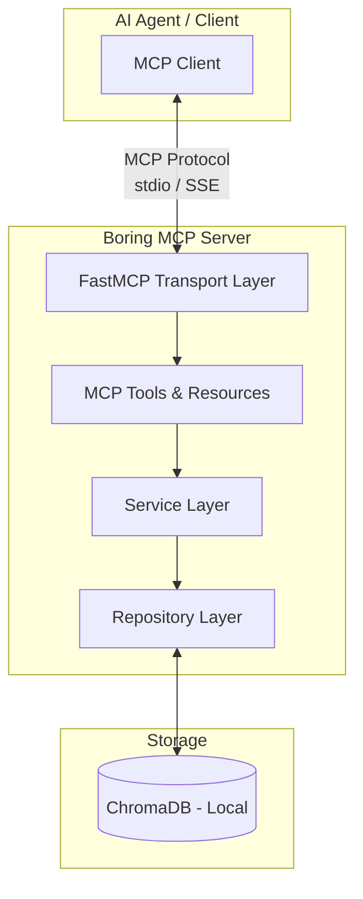
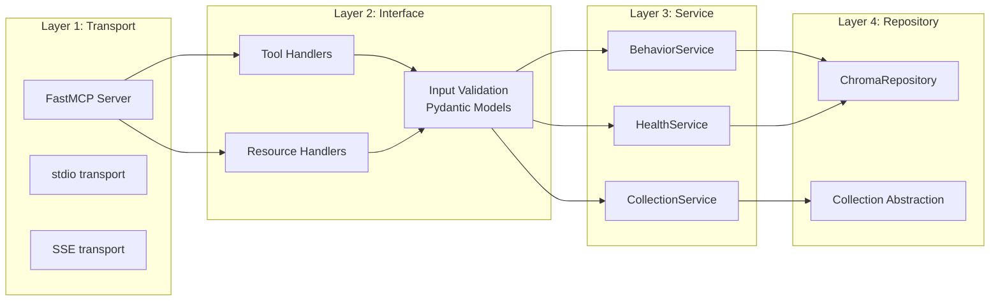
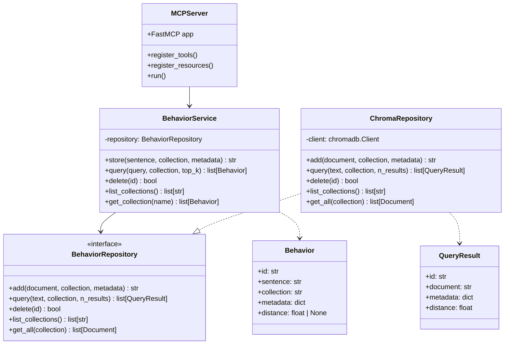
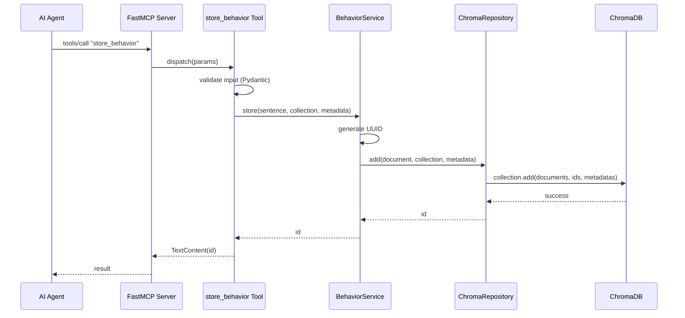
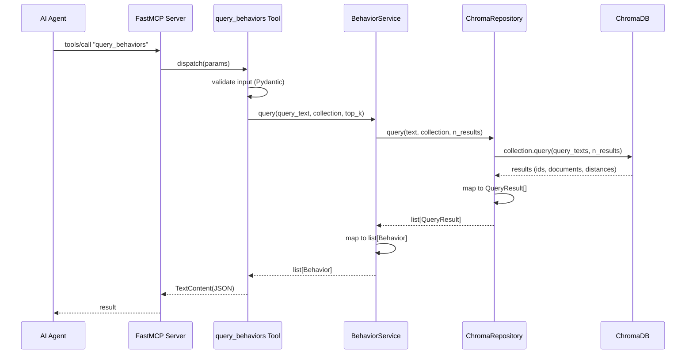
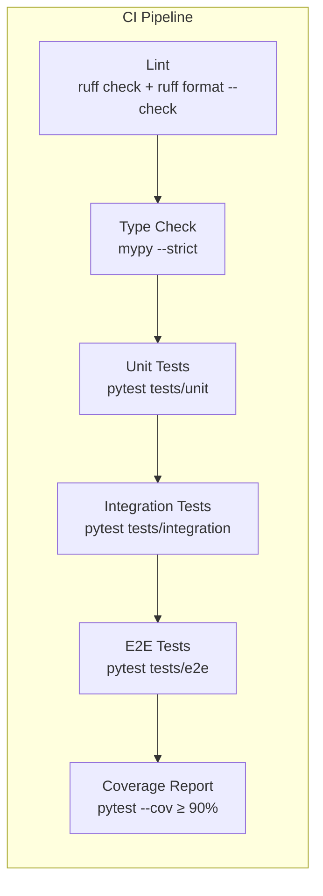

# Boring MCP — Architecture

## Overview

Boring MCP is a **Model Context Protocol** server built with **FastMCP** (Python),
backed by a local **ChromaDB** vector database. It follows a strict layered architecture
with full type safety (MyPy strict mode) and comprehensive test coverage.

---

## High-Level Architecture



---

## Layer Responsibilities



---

## Component Diagram



---

## Data Flow: Store Behavior



---

## Data Flow: Query Behaviors



---

## Project Structure

```
boring-mcp/
├── pyproject.toml              # Project config, dependencies, mypy, pytest
├── README.md                   # User-facing documentation
├── agents.md                   # Agent integration guide
├── architecture.md             # This file
│
├── src/
│   └── boring_mcp/
│       ├── __init__.py
│       ├── server.py           # FastMCP server setup & entry point
│       ├── tools/
│       │   ├── __init__.py
│       │   ├── behaviors.py    # store_behavior, query_behaviors, delete_behavior
│       │   ├── collections.py  # list_collections
│       │   └── health.py       # health_check
│       ├── resources/
│       │   ├── __init__.py
│       │   └── behaviors.py    # behaviors://{collection}, behaviors://summary
│       ├── services/
│       │   ├── __init__.py
│       │   ├── behavior_service.py
│       │   └── health_service.py
│       ├── repositories/
│       │   ├── __init__.py
│       │   ├── base.py         # BehaviorRepository (Protocol/ABC)
│       │   └── chroma.py       # ChromaRepository implementation
│       └── models/
│           ├── __init__.py
│           ├── behavior.py     # Behavior dataclass
│           ├── requests.py     # Pydantic input models
│           └── results.py      # QueryResult dataclass
│
├── tests/
│   ├── __init__.py
│   ├── conftest.py             # Shared fixtures (in-memory ChromaDB client)
│   ├── unit/
│   │   ├── __init__.py
│   │   ├── test_behavior_service.py
│   │   ├── test_chroma_repository.py
│   │   └── test_models.py
│   ├── integration/
│   │   ├── __init__.py
│   │   ├── test_tools.py
│   │   └── test_resources.py
│   └── e2e/
│       ├── __init__.py
│       └── test_mcp_protocol.py
│
└── scripts/
    └── seed_behaviors.py       # Script to seed initial behaviors
```

---

## Technology Stack

| Component        | Technology         | Rationale                                     |
|------------------|--------------------|-----------------------------------------------|
| MCP Framework    | FastMCP ≥ 2.0      | Official Python MCP SDK, batteries-included   |
| Vector DB        | ChromaDB (local)   | Zero-config local vector store, Python native |
| Type Checking    | MyPy (strict)      | Catch bugs before runtime                     |
| Validation       | Pydantic v2        | Runtime input validation with great DX        |
| Testing          | pytest + pytest-cov| Industry standard, plugin ecosystem           |
| Linting          | Ruff               | Fast, replaces flake8 + isort + black         |
| Package Manager  | uv                 | Fast, modern Python package management        |
| Python Version   | 3.11+              | Required for modern typing features           |

---

## Test Pipeline



### Test Levels

| Level       | Scope                           | Dependencies          | Speed   |
|-------------|----------------------------------|-----------------------|---------|
| Unit        | Service logic, models, mapping   | None (mocked repos)   | < 1s    |
| Integration | Tools + Services + ChromaDB      | In-memory ChromaDB    | < 5s    |
| E2E         | Full MCP protocol round-trip     | Full server instance  | < 10s   |

---

## Configuration

Configuration is managed via environment variables with sensible defaults:

| Variable                 | Default              | Description                      |
|--------------------------|----------------------|----------------------------------|
| `BORING_MCP_CHROMA_PATH` | `./data/chroma`     | ChromaDB persistence directory   |
| `BORING_MCP_TRANSPORT`   | `stdio`             | Transport: `stdio` or `sse`      |
| `BORING_MCP_LOG_LEVEL`   | `INFO`              | Logging verbosity                |

---

## Design Decisions

### Why ChromaDB (Local)?

- Zero infrastructure overhead — runs in-process
- Handles embedding generation internally (default model)
- Simple Python API
- Persistent storage with a single path config
- Perfect for single-user / single-agent deployments

### Why FastMCP?

- Official MCP Python SDK from Anthropic
- Decorator-based tool/resource registration
- Built-in input validation
- Handles protocol serialization
- Supports both stdio and SSE transports

### Why Strict MyPy?

- The project name is "Boring" — we embrace predictability
- Catches None-safety issues, missing returns, type mismatches
- Forces explicit typing at boundaries (especially important for the service layer)
- Repository interface uses Protocol for structural subtyping

### Why Layered Architecture?

- **Testability** — each layer can be tested in isolation
- **Replaceability** — swap ChromaDB for Pinecone by implementing a new repository
- **Clarity** — new contributors know exactly where code belongs
- **Boring** — no surprises, no circular dependencies, just layers
